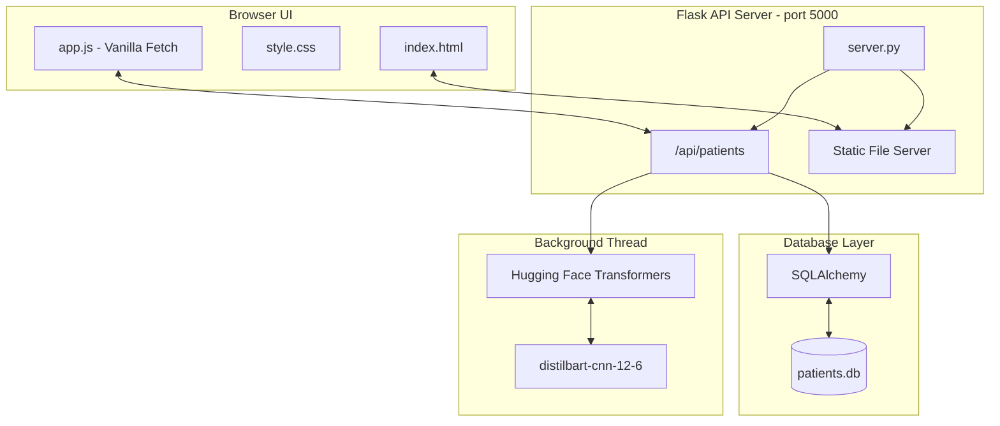

# Patient Medical History Summary Application

A full-stack, AI-powered application designed to streamline patient checkups by retrieving medical histories and providing automated summaries and clinical recommendations to doctors. 

Developed as an internship use-case project for **Agenix AI**.

## 🚀 Features

* **AI-Powered Summarization:** Uses Hugging Face's `distilbart-cnn-12-6` NLP model to dynamically generate concise medical narratives from patient data.
* **Interactive Dashboard:** Premium, responsive UI with dark mode, glassmorphism, and smooth micro-animations.
* **Rule-based Clinical Recommendations:** Automatically flags critical issues (like allergies or chronic conditions) to assist doctors.
* **Zero-Setup Database:** Uses an embedded SQLite database (`patients.db`) that automatically seeds sample data on the first run.
* **Unified Single-Port Execution:** Flask serves both the REST API and the frontend HTML/JS/CSS assets on a single port for seamless local execution and easy remote sharing (via Ngrok/Wi-Fi).

---

## 🏗️ System Architecture



---

## 🛠️ Tech Stack

* **Frontend:** HTML5, Vanilla JavaScript, Vanilla CSS
* **Backend:** Python, Flask, Flask-CORS
* **Database:** SQLite, SQLAlchemy (ORM)
* **Machine Learning:** PyTorch, Hugging Face `transformers`

---

## ⚙️ Setup & Installation

### Prerequisites
* Python 3.8+ installed on your system.

### 1. Install Dependencies
Open your terminal in the project directory and install the required Python packages:
```bash
pip install -r requirements.txt
```

### 2. Run the Application
Start the Flask server. Because Flask is configured to serve the frontend directly, you only need one command!
```bash
python server.py
```

### 3. Open the App
* If you are running it locally, open your web browser and navigate to:
  👉 **`http://localhost:5000`**
* **Note on AI Model Loading:** On the very first run, the server will download the Hugging Face summarization model (~1.22 GB) in the background. The app remains fully usable during this time thanks to a fast programmatic text fallback.

---

## 📝 Design Decisions & Optimizations

1. **Why SQLite instead of PostgreSQL/MySQL?**
   * **Zero friction:** It requires no external server setup, making it perfect for an internship evaluation where reviewers can just run `python server.py` and have it work instantly.
   * **Portability:** The entire DB is a single auto-generated file (`patients.db`).
   * **Scalability:** By using SQLAlchemy, migrating to a heavy production database (like PostgreSQL) only requires changing one line of code (the connection string).

2. **Why Vanilla JS/CSS instead of React/Tailwind?**
   * Keeps the project extremely lightweight without needing Node.js or Webpack build steps.

3. **Background Threaded AI Inference:**
   * Loading a 1.2GB PyTorch model blocks the main thread for several seconds (or minutes on the first download). To solve this, the `transformers` pipeline is initialized in a separate background thread. The Flask server starts instantly, ensuring a smooth user experience.

---

## 👨‍💻 Developer Notes
This repository includes a `.gitignore` to intentionally exclude the `patients.db` file, local python environments (`.venv`), and model caches to keep the repository clean.
