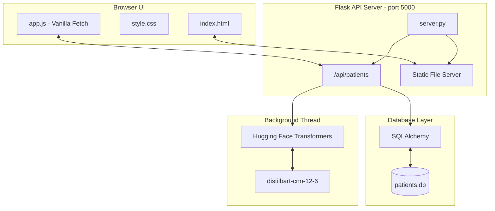

# Patient Medical History Summary Application

A full-stack, AI-powered application designed to streamline patient checkups by retrieving medical histories and providing automated summaries and clinical recommendations to doctors. 

Developed as an internship use-case project for **Agenix AI**.

## 🚀 Features

* **AI-Powered Summarization:** Uses Hugging Face's `distilbart-cnn-12-6` NLP model to dynamically generate concise medical narratives from patient data.
* **Interactive Dashboard:** Premium, responsive UI with dark mode, glassmorphism, and smooth micro-animations.
* **Rule-based Clinical Recommendations:** Automatically flags critical issues (like allergies or chronic conditions) to assist doctors.
* **Zero-Setup Database:** Uses an embedded SQLite database (`patients.db`) that automatically seeds sample data on the first run.
* **Unified Single-Port Execution:** Flask serves both the REST API and the frontend HTML/JS/CSS assets on a single port for seamless local execution and easy remote sharing (via Ngrok/Wi-Fi).

---

## 🏗️ System Architecture



---

## 🛠️ Tech Stack

* **Frontend:** HTML5, Vanilla JavaScript, Vanilla CSS
* **Backend:** Python, Flask, Flask-CORS
* **Database:** SQLite, SQLAlchemy (ORM)
* **Machine Learning:** PyTorch, Hugging Face `transformers`

---

## ⚙️ Setup & Installation

### Prerequisites
* Python 3.8+ installed on your system.

### 1. Install Dependencies
Open your terminal in the project directory and install the required Python packages:
```bash
pip install -r requirements.txt
```

### 2. Run the Application
Start the Flask server. Because Flask is configured to serve the frontend directly, you only need one command!
```bash
python server.py
```

### 3. Open the App
* If you are running it locally, open your web browser and navigate to:
  👉 **`http://localhost:5000`**
* **Note on AI Model Loading:** On the very first run, the server will download the Hugging Face summarization model (~1.22 GB) in the background. The app remains fully usable during this time thanks to a fast programmatic text fallback.

---

## 🔗 Share the Project (GitHub + Ngrok)

You can give reviewers **two links** so they can either inspect the code or try the app instantly—no install required for the live demo.

| Link | Best for | What the reviewer does |
|------|----------|-------------------------|
| **GitHub repo** | Source code, local setup, code review | Clone the repo → follow the **Setup & Installation** section above |
| **Ngrok URL** | Quick live demo in a browser | Open your public HTTPS link—no Python, pip, or downloads |

Flask serves the UI and API on a **single port (`5000`)**, which makes Ngrok a one-command tunnel.

### Option A — Cloudflare Tunnel (no signup, fastest)

Install [cloudflared](https://developers.cloudflare.com/cloudflare-one/connections/connect-networks/downloads/) (or `winget install Cloudflare.cloudflared`), then:

**Terminal 1:**
```bash
python server.py
```

**Terminal 2:**
```bash
cloudflared tunnel --url http://127.0.0.1:5000
```

Copy the `https://….trycloudflare.com` URL from the output.

Or run both with the helper script (defaults to cloudflared):
```powershell
.\start-demo.ps1
```

### Option B — Ngrok (on your machine only)

1. [Install ngrok](https://ngrok.com/download) and create a free account.
2. Connect your account (one-time), following the command shown on the ngrok dashboard, for example:
   ```bash
   ngrok config add-authtoken YOUR_TOKEN_HERE
   ```

### Run a live demo (Ngrok)

**Terminal 1** — start the app (same as local setup):

```bash
pip install -r requirements.txt
python server.py
```

Wait until you see Flask listening on port `5000`.

**Terminal 2** — expose port 5000:

```bash
ngrok http 5000
```

Copy the **Forwarding** HTTPS URL from the ngrok output (e.g. `https://abc123.ngrok-free.app`) and share it alongside your GitHub link.

### Example message to reviewers

```text
Code:  https://github.com/karann18/patient-medical-history-app
Demo:  https://YOUR-NGROK-URL.ngrok-free.app

The demo link works while my machine is running the app. For local setup, see the README.
```

### Important notes

* **You host the demo.** Ngrok forwards traffic to *your* running `server.py`. If you stop the server, close your laptop, or quit ngrok, the demo link stops working.
* **Keep both terminals open** during a review or demo session.
* **Free ngrok URLs** usually change each time you restart ngrok unless you use a reserved domain on a paid plan.
* **Free tier interstitial:** Visitors may see a short ngrok warning page once; they click **Visit Site** to continue.
* **Demo data only:** Sample patients are seeded for evaluation—do not put real patient health information on a shared tunnel.
* **First run:** The NLP model may still be downloading on your machine; summaries use a fast text fallback until the model is ready.

---

## 📝 Design Decisions & Optimizations

1. **Why SQLite instead of PostgreSQL/MySQL?**
   * **Zero friction:** It requires no external server setup, making it perfect for an internship evaluation where reviewers can just run `python server.py` and have it work instantly.
   * **Portability:** The entire DB is a single auto-generated file (`patients.db`).
   * **Scalability:** By using SQLAlchemy, migrating to a heavy production database (like PostgreSQL) only requires changing one line of code (the connection string).

2. **Why Vanilla JS/CSS instead of React/Tailwind?**
   * Keeps the project extremely lightweight without needing Node.js or Webpack build steps.

3. **Background Threaded AI Inference:**
   * Loading a 1.2GB PyTorch model blocks the main thread for several seconds (or minutes on the first download). To solve this, the `transformers` pipeline is initialized in a separate background thread. The Flask server starts instantly, ensuring a smooth user experience.

---

## 👨‍💻 Developer Notes
This repository includes a `.gitignore` to intentionally exclude the `patients.db` file, local python environments (`.venv`), and model caches to keep the repository clean.
